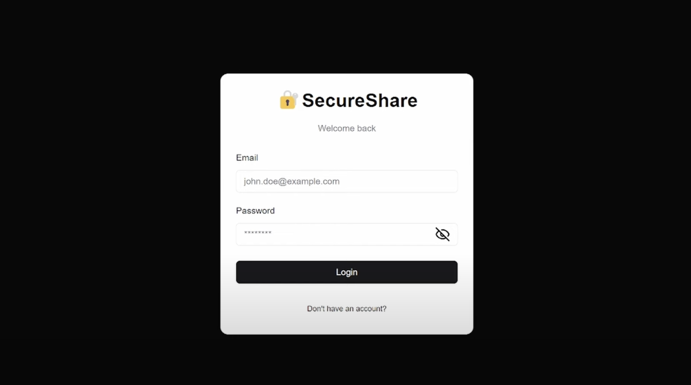
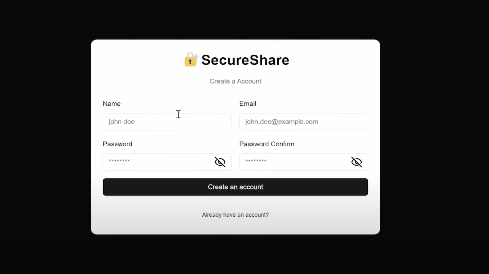
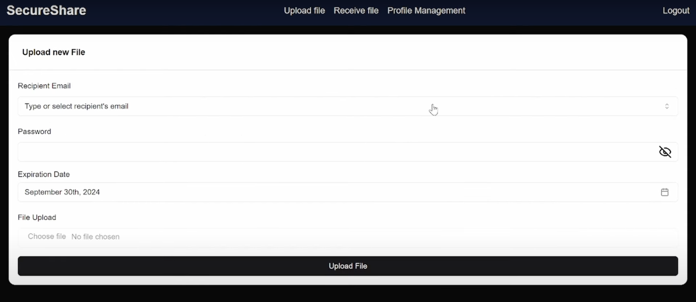
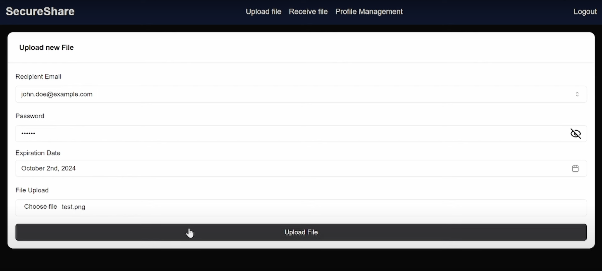
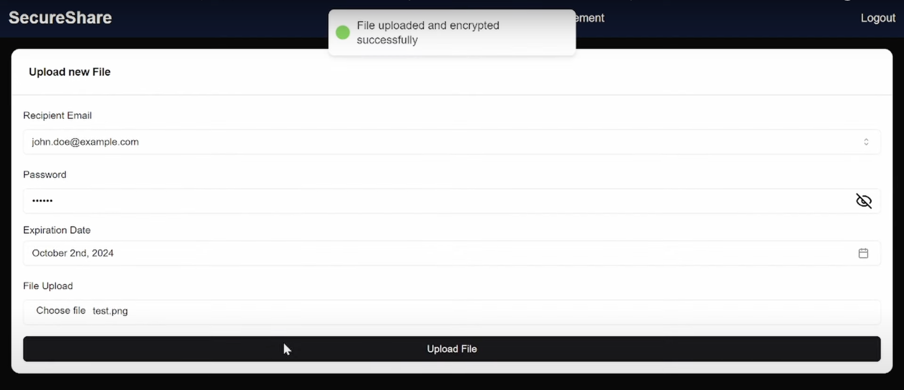

# 🔐 SecureShare - Encrypted File Sharing App

SecureShare is a privacy-focused file-sharing application developed to ensure secure transmission and access of files over the internet. Designed with end-to-end encryption, password protection, and expirable share links, it’s a modern take on file sharing—with privacy at its core.

> ⚙️ **Built using RUST**


## 📌 Problem Statement

In today’s world, data is currency. However, sharing files securely—without depending on unencrypted channels or trusting third parties—remains a challenge. Most file-sharing platforms don’t prioritize zero-trust models or robust encryption mechanisms.

**SecureShare** addresses this by:

* Encrypting files using AES.
* Storing encrypted keys safely.
* Allowing sharing via password-protected and time-limited links.

## 🛠️ Technologies Used

| Area          | Technology                    |
| ------------- | ----------------------------- |
| Backend       | Rust (Axum framework)         |
| Frontend      | Next.js, Tailwind CSS         |
| Database      | PostgreSQL                    |
| ORM           | SQLx                          |
| Auth          | JWT                           |
| Encryption    | AES + RSA (hybrid encryption) |
| UI Components | Shadcn UI + Radix UI          |
| Styling       | TailwindCSS                   |


## 🚀 Features

* 🔑 User registration & login with secure password hashing
* 📁 Upload files with AES encryption
* 🔗 Share files via expirable links
* 🔒 Password-protected file access
* 📜 Audit-ready schema with UUID-based user/file IDs
* ⚡ Minimal UI built with modern React & Shadcn components


## 📸 Demo








## 🔧 How to Run

```bash
# Clone the repo
git clone https://github.com/yourusername/secure-file-share.git
cd secure-file-share

# Set up environment variables
cp .env.example .env
# Add your database URL and JWT secret

# Run the backend (Rust)
cargo run

# Run the frontend
cd secureshare_frontend
npm install
npm run dev
```

## ✅ What's Next?

* Drag-and-drop file support
* Email notifications for shared links
* Admin dashboard (file audit & usage metrics)
* Docker support for simplified deployment


## 💡 Why Rust?

Rust offers memory safety, blazing-fast performance, and excellent support for concurrent programming—perfect for a security-critical app like this. Building SecureShare in Rust helped solidify foundational knowledge in:

* Ownership and lifetimes
* Asynchronous programming
* Modular architecture
* Security-first design